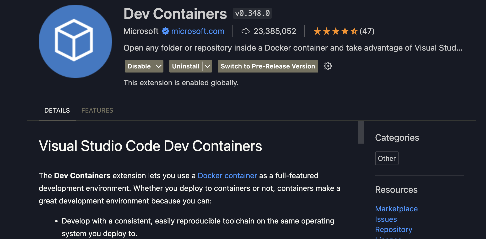
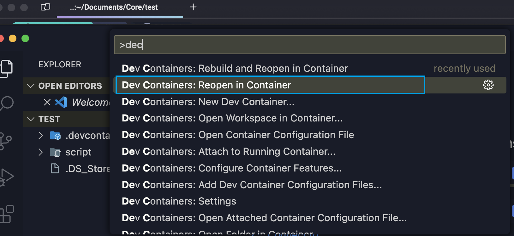

- ## Environment Directories

  ### Work Directory

  + Path:

    ```bash
    /Users/tengzhang/Documents/Core/HOME_DIR/
    ```

    + This directory serves as the primary workspace where all projects and database data reside. It's designed to streamline development workflows by centralizing essential resources.

  ### Script Directory

  + Path:

    ```bash
    /Users/tengzhang/Documents/Core/HOME_DIR/script/
    ```

    + Dedicated to storing utility scripts that automate common tasks, enhance productivity, and facilitate a seamless development experience.

  ### Ubuntu Bindings

  + User Home in Ubuntu

    ```
    /home/fleeting-sound
    ```

    + In the Ubuntu environment, the work directory is mapped to `/home/fleeting-sound`. This binding ensures a consistent and accessible workspace across different operating systems, allowing for fluid transition and operation within the Ubuntu context.

  ### Data Persistence

  + The work directory not only contains project files but also hosts database data. This setup ensures that all necessary data for development is bound and persisted within a single, easily manageable location.

  ### Install Dependencies
  + [x] Homebrew
  + [x] Zsh
  + [x] Starship
  + [x] Node
  + [x] Bun
  + [x] Python, pyenv, poetry
  + [x] MySQL
  + [x] PostgreSQL
  + [x] Redis


### Bash/Zsh Theme


## How to Use

### Prerequisites

Before starting, make sure you have the following installed:

+ **[Docker](https://www.docker.com/products/docker-desktop/)**

+ **[Visual Studio Code (VS Code)](https://code.visualstudio.com/)**

+ VS Code Extension - [Remote - Containers](https://marketplace.visualstudio.com/items?itemName=ms-vscode-remote.remote-containers)

  + 

### Setting Up

Follow these steps to set up your environment:

1. Clone the Repository

   + Navigate to your desired folder and clone the repository using Git:

     ```shell
     git clone git@github.com:JakeZT/dev-container.git
     ```

2. Open VS Code

   + Launch Visual Studio Code and navigate to the cloned project directory.

3. Activate the Dev Container

   + With the project open in VS Code, access the Command Palette (`Ctrl+Shift+P` on Windows/Linux, `Cmd+Shift+P` on macOS) and search for **Remote-Containers: Reopen in Container**.
   + 
   + Follow the prompts, and the Dev Container extension will start setting up your environment automatically.
     + **Important**: During the setup, when prompted to install `homebrew`, press `Enter` to proceed.

   

### Configuration

+ File `.devcontainer/devcontainer.json`

  + ```json
    {
    "name": "Ubuntu",
    "runArgs": ["--platform=linux/amd64"],
    "image": "mcr.microsoft.com/devcontainers/base:jammy",
    "mounts": [
    "source=/Users/tengzhang/Documents/Core/HOME_DIR/,target=/home/fleeting-sound,type=bind",
    "source=/Users/tengzhang/Documents/Core/HOME_DIR/script,target=/home/fleeting-sound/script,type=bind"
    ],
    "postCreateCommand": "/home/fleeting-sound/script/init-container.sh",
    "forwardPorts": [3000,3001,3002,3003,3004,3005, 5000,8000,8080,9000,5432,3306,27017,6379]
    }
    ```

+ File `init.container.sh`

  + ```shell
    #!/bin/bash
    
    # Install homebrew
    /bin/bash -c "$(curl -fsSL https://raw.githubusercontent.com/Homebrew/install/HEAD/install.sh)"
    
    (echo; echo 'eval "$(/home/linuxbrew/.linuxbrew/bin/brew shellenv)"') >> /home/vscode/.bashrc
    eval "$(/home/linuxbrew/.linuxbrew/bin/brew shellenv)"
    echo 'export PATH="/usr/local/bin:$PATH"' | sudo tee -a ~/.bashrc
    echo "source ~/.bashrc" | source ~/.bashrc
    
    #Install zsh & related packages
    brew install zsh starship zsh-autosuggestions zsh-history-substring-search
    
    #Install other dependencies
    # brew install python pyenv pyenv-virtualenv poetry mysql postgresql  redis
    
    # Install Bun
    curl -fsSL https://bun.sh/install | bash
    source /home/vscode/.bashrc
    source ~/.bashrc
    
    #Install volta
    brew install volta
    
    (
    echo 'eval "$(starship init bash)"'
    ) >> ~/.bashrc
    
    # Update bashrc and zshrc
    (
    echo 'export VOLTA_HOME="$HOME/.volta"'
    echo 'export PATH="$VOLTA_HOME/bin:$PATH"'
    echo 'eval "$(/home/linuxbrew/.linuxbrew/bin/brew shellenv)"'
    echo 'export BUN_INSTALL="$HOME/.bun"'
    echo 'export PATH="$BUN_INSTALL/bin:$PATH"'
    ) | tee -a ~/.bashrc ~/.zshrc >/dev/null
    
    
    (
    echo 'source $(brew --prefix)/share/zsh-autosuggestions/zsh-autosuggestions.zsh'
    echo 'source $(brew --prefix)/share/zsh-history-substring-search/zsh-history-substring-search.zsh'
    echo 'eval "$(starship init zsh)"'
    ) >> ~/.zshrc
    
    # Setup starfish theme
    mkdir -p ~/.config && touch ~/.config/starship.toml
    cp /home/fleeting-sound/script/starship.toml ~/.config/starship.toml
    
    source ~/.bashrc
    source ~/.zshrc
    
    # Install node
    volta install node@18
    
    # Install common node packages
    bun i -g rimraf pnpm
    
    # Install nerd fonts and then check installed fonts
    # brew install fontconfig
    
    # mkdir -p ~/.local/share/fonts/NerdFonts
    # cd ~/.local/share/fonts/NerdFonts
    # wget https://github.com/ryanoasis/nerd-fonts/releases/download/v3.1.1/CascadiaCode.zip
    # wget https://github.com/ryanoasis/nerd-fonts/releases/download/v3.1.1/CascadiaMono.zip
    
    # unzip CascadiaCode.zip -d CaskaydiaCove
    # unzip CascadiaMono.zip -d CascadiaMono
    
    # fc-cache -fv
    # fc-list | grep -i "CaskaydiaCove"
    # fc-list | grep -i "CascadiaMono"
    
    # Open a new bash
    exec /bin/bash
    
    # Success echo
    echo "All dependencies have been installed successfully!"
    


### Connecting to the Container

```bash
docker ps  # Get container ID

docker exec -it YOUR_CONTAINER_ID bash
docker exec -it c05bd90de191 bash # For instance

cd /workspaces/HOME_DIR  # Macbook folder /Ubuntu
# OR
cd /home/fleeting-sound/  # Mac mounted directory

exit # Exit the remote terminal
```


### Run My SQL

```bash
mysqld --initialize --basedir=/home/linuxbrew/.linuxbrew/bin/mysql --datadir=/home/fleeting-sound/MYSQL_DATA

mysql -u root
CREATE DATABASE test;
ALTER USER 'root'@'localhost' IDENTIFIED BY 'root';
FLUSH PRIVILEGES;
quit;
```


### Run PostgreSQL

```bash
/home/linuxbrew/.linuxbrew/opt/postgresql@14/bin/postgres --version
# init database
initdb -D /home/fleeting-sound/POSTGRESQL_DATA
# start server
pg_ctl -D /home/fleeting-sound/POSTGRESQL_DATA -l logfile start

#create user
/home/linuxbrew/.linuxbrew/opt/postgresql@14/bin/createuser -s postgres

psql -U postgres

CREATE DATABASE test;

quit;

```


### Run Redis

```shell
# Remove IPV6 BINDING
nano /home/linuxbrew/.linuxbrew/etc/redis.conf
# Replace bind 127.0.0.1 :1  to bind 127.0.0.1

# Run redis
redis-server /home/linuxbrew/.linuxbrew/etc/redis.conf

```


### Terminate running services

```shell
ps aux | grep mysqld
ps aux | grep postgresql@14

kill <pid>
```