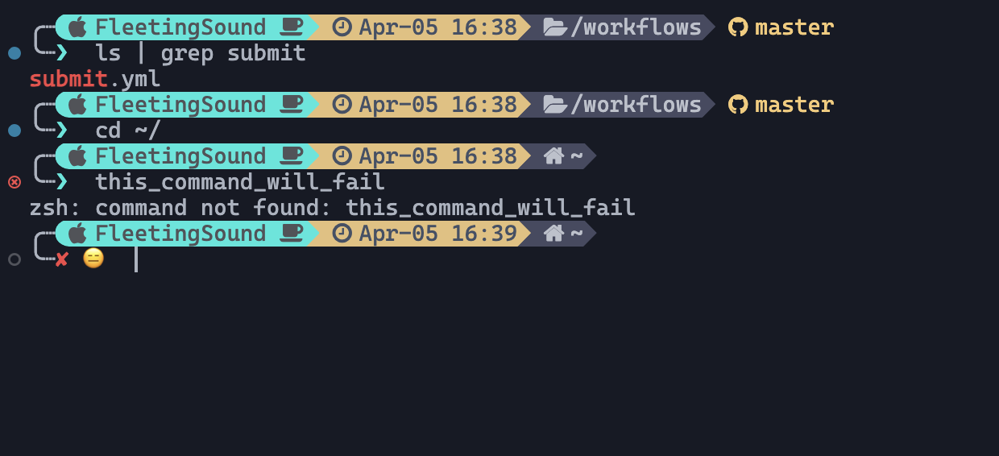

### INFO

- MY MAC HOME ADDRESS
  - `/Users/tengzhang/Documents/Core/HOME_DIR/`

- INIT SCRIPTS
  - `/Users/tengzhang/Documents/Core/HOME_DIR/script`

- All the projects and DATABASE data are binded in this HOME directory

- Install `Dev Containers` in VSCODE

- run `dev containers: reopen and rebuild container`

- Use `starship` to customize the bash/zsh theme

- Install Dependencies
  + [x] Homebrew
  + [x] Zsh
  + [x] Starship
  + [x] Node
  + [x] Bun
  + [x] Python, pyenv, poetry
  + [x] MySQL
  + [x] PostgreSQL
  + [x] Redis

### Bash/Zsh Theme


### Update devcontainer.json
### DEV CONTAINERS: OPEN CONTAINER CONFIGURATION FILE
```json
{
	"name": "Ubuntu",
	"runArgs": ["--platform=linux/amd64"],
	"image": "mcr.microsoft.com/devcontainers/base:jammy",
	"mounts": [
		"source=/Users/tengzhang/Documents/Core/HOME_DIR/,target=/home/teng,type=bind",
		"source=/Users/tengzhang/Documents/Core/HOME_DIR/script,target=/home/teng/script,type=bind"
	],
  "postCreateCommand": "/home/teng/script/init-container.sh",
  "forwardPorts": [3000,3001,3002,3003,3004,3005, 5000,8000,8080,9000,5432,3306,27017,6379]
}
```

### Use terminal to connect to this dev-container

```bash
docker ps  # get container ID

docker exec -it c05bd90de191 bash # Replace the container ID

cd /workspaces/HOME_DIR  #my macbook folder /Ubuntu

exit # exit the remote terminal
```


### init.container.sh

```bash
#!/bin/bash

# Install homebrew
/bin/bash -c "$(curl -fsSL https://raw.githubusercontent.com/Homebrew/install/HEAD/install.sh)"

# echo 'eval "$(/home/linuxbrew/.linuxbrew/bin/brew shellenv)"' | sudo tee -a ~/.bashrc
(echo; echo 'eval "$(/home/linuxbrew/.linuxbrew/bin/brew shellenv)"') >> /home/vscode/.bashrc
eval "$(/home/linuxbrew/.linuxbrew/bin/brew shellenv)"
echo 'export PATH="/usr/local/bin:$PATH"' | sudo tee -a ~/.bashrc
echo "source ~/.bashrc" | source ~/.bashrc

#Enter zsh
brew install zsh starship zsh-autosuggestions zsh-history-substring-search


#Install dependencies
brew install python pyenv pyenv-virtualenv poetry mysql postgresql  redis

# Install Bun
curl -fsSL https://bun.sh/install | bash
source /home/vscode/.bashrc
source ~/.bashrc


#Install volta
brew install volta

# update bashrc and zshrc
(
echo 'export VOLTA_HOME="$HOME/.volta"'
echo 'export PATH="$VOLTA_HOME/bin:$PATH"'
echo 'eval "$(/home/linuxbrew/.linuxbrew/bin/brew shellenv)"'
echo 'export BUN_INSTALL="$HOME/.bun"'
echo 'export PATH="$BUN_INSTALL/bin:$PATH"'
) | tee -a ~/.bashrc ~/.zshrc >/dev/null

(
echo 'eval "$(starship init bash)"'
) >> ~/.bashrc

(
echo 'source $(brew --prefix)/share/zsh-autosuggestions/zsh-autosuggestions.zsh'
echo 'source $(brew --prefix)/share/zsh-history-substring-search/zsh-history-substring-search.zsh'
echo 'eval "$(starship init zsh)"'
) >> ~/.zshrc

mkdir -p ~/.config && touch ~/.config/starship.toml
cp /home/teng/script/starship.toml ~/.config/starship.toml

source ~/.bashrc
source ~/.zshrc

#Install node
volta install node@18

bun i -g rimraf pnpm

#Install nerd fonts
brew install fontconfig
mkdir -p ~/.local/share/fonts/NerdFonts
cd ~/.local/share/fonts/NerdFonts
wget https://github.com/ryanoasis/nerd-fonts/releases/download/v3.1.1/CascadiaCode.zip
wget https://github.com/ryanoasis/nerd-fonts/releases/download/v3.1.1/CascadiaMono.zip

unzip CascadiaCode.zip -d CaskaydiaCove
unzip CascadiaMono.zip -d CascadiaMono

#Install fonts
fc-cache -fv

#Check installed fonts
fc-list | grep -i "CaskaydiaCove"
fc-list | grep -i "CascadiaMono"


# End
echo "Dependencies have been installed successfully!"

```


### Run MYSQL

```bash
mysqld --initialize --basedir=/home/linuxbrew/.linuxbrew/bin/mysql --datadir=/home/teng/MYSQL_DATA

mysql -u root
CREATE DATABASE test;
ALTER USER 'root'@'localhost' IDENTIFIED BY 'root';
FLUSH PRIVILEGES;
quit;
```

### RUN POSTGRESQL
```bash
/home/linuxbrew/.linuxbrew/opt/postgresql@14/bin/postgres --version
# init database
initdb -D /home/teng/POSTGRESQL_DATA
# start server
pg_ctl -D /home/teng/POSTGRESQL_DATA -l logfile start

#create user
/home/linuxbrew/.linuxbrew/opt/postgresql@14/bin/createuser -s postgres

psql -U postgres

CREATE DATABASE test;

quit;

```

### RUN REDIS
```shell
# Remove IPV6 BINDING
nano /home/linuxbrew/.linuxbrew/etc/redis.conf
# Replace bind 127.0.0.1 :1  to bind 127.0.0.1

# Run redis
redis-server /home/linuxbrew/.linuxbrew/etc/redis.conf

```

### Terminate services
```shell
ps aux | grep mysqld
ps aux | grep postgresql@14

kill <id>

```